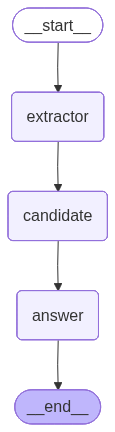
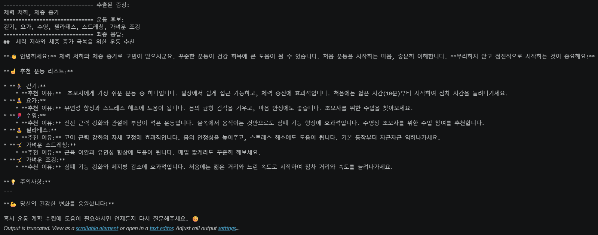

# LangGraph 기반 운동 추천 멀티에이전트 실습

## 1. 프로젝트 소개

본 프로젝트는 `LangGraph`를 활용하여 사용자의 질문을 단계적으로 처리하는 멀티에이전트 워크플로우를 구현한 실습 프로젝트입니다.

사용자의 질문에서 운동 추천에 필요한 증상 또는 고민 상태를 추출하고, 해당 상태를 해결하는 데 도움이 될 수 있는 운동 후보를 생성한 뒤, 최종적으로 사용자가 이해하기 쉬운 개조식 답변을 생성합니다.

예시 질문은 다음과 같습니다.

```text
체력이 안 좋고, 살이 계속 찌는데 어떤 운동을 할까?
```

본 프로젝트는 단순히 LLM에 한 번 질문하고 답변을 받는 구조가 아니라, 여러 개의 역할 기반 에이전트를 `LangGraph`의 노드로 구성하여 순차적으로 실행하는 구조입니다.

---

## 2. 프로젝트 목적

본 프로젝트의 목적은 다음과 같습니다.

- LangGraph의 기본 구조 이해
- StateGraph를 활용한 상태 기반 워크플로우 구현
- 역할이 분리된 멀티에이전트 구조 실습
- LangChain의 PromptTemplate과 LLM Chain 활용
- Ollama 기반 로컬 LLM 실행
- 그래프 구조 시각화 및 실행 결과 확인

---

## 3. 멀티에이전트 구조 소개

본 프로젝트는 총 3개의 에이전트로 구성되어 있습니다.

| 에이전트 | 역할 | 입력값 | 출력값 |
|---|---|---|---|
| 추출 에이전트 | 사용자 질문에서 증상 또는 고민 상태 추출 | 사용자 질문 | 체력 저하, 체중 증가 등 |
| 후보 에이전트 | 추출된 증상을 바탕으로 운동 후보 생성 | 추출된 증상 | 걷기, 요가, 수영, 필라테스 등 |
| 답변 생성 에이전트 | 증상과 운동 후보를 바탕으로 최종 답변 생성 | 증상, 운동 후보 | 개조식 운동 추천 답변 |

각 에이전트는 독립적인 프롬프트를 사용하며, `LangGraph`의 `StateGraph`를 통해 순차적으로 연결됩니다.

---

## 4. 전체 처리 흐름

```text
사용자 질문
   ↓
[Extractor Agent]
사용자의 증상 또는 고민 상태 추출
   ↓
[Candidate Agent]
증상 해결에 적합한 운동 후보 생성
   ↓
[Answer Agent]
증상과 운동 후보를 바탕으로 최종 답변 생성
   ↓
최종 응답 출력
```

본 프로젝트의 핵심은 `AgentState`라는 상태값이 각 노드를 지나면서 점진적으로 채워진다는 점입니다.

---

## 5. 기술 스택

| 기술 | 사용 목적 |
|---|---|
| Python | 전체 프로젝트 구현 언어 |
| LangGraph | 에이전트 실행 흐름을 그래프 구조로 구성 |
| LangChain | PromptTemplate 및 LLM Chain 구성 |
| Ollama | 로컬 환경에서 LLM 실행 |
| EXAONE 3.5 | Ollama에서 사용하는 언어 모델 |
| IPython | 그래프 구조 이미지 출력 |

---

## 6. Repository 구조

현재 Repository 구조는 다음과 같습니다.

```text
langgraph-exercise-agent/
│
├── README.md
├── main.py
├── requirements.txt
├── graph_structure.png
└── result_capture.png
```

| 파일 | 설명 |
|---|---|
| `README.md` | 프로젝트 설명 문서 |
| `main.py` | LangGraph 멀티에이전트 실행 코드 |
| `requirements.txt` | 실행에 필요한 Python 라이브러리 목록 |
| `graph_structure.png` | LangGraph 그래프 구조 이미지 |
| `result_capture.png` | 실행 결과 캡처 이미지 |

---

## 7. 사용 모델

본 프로젝트에서는 Ollama를 통해 로컬 LLM 모델을 실행합니다.

```python
llm = Ollama(model="exaone3.5:7.8b")
```

Ollama를 사용하면 외부 API Key 없이 로컬 환경에서 LLM 기반 에이전트 실습을 진행할 수 있습니다.

---

## 8. 상태 정의

LangGraph에서는 각 노드가 공유하는 상태값을 정의해야 합니다.

본 프로젝트에서는 `TypedDict`를 사용하여 상태 구조를 정의했습니다.

```python
class AgentState(TypedDict, total=False):
    query: str
    symptoms: str
    exercise_candidates: str
    result: str
```

각 상태값의 의미는 다음과 같습니다.

| 상태값 | 설명 |
|---|---|
| `query` | 사용자가 입력한 원본 질문 |
| `symptoms` | 추출 에이전트가 추출한 증상 또는 고민 |
| `exercise_candidates` | 후보 에이전트가 생성한 운동 후보 리스트 |
| `result` | 답변 생성 에이전트가 생성한 최종 응답 |

각 에이전트는 기존 상태값을 유지하면서 새로운 결과를 추가합니다.

예를 들어 첫 번째 노드에서는 `query`를 입력받아 `symptoms`를 추가하고, 두 번째 노드에서는 `symptoms`를 바탕으로 `exercise_candidates`를 추가합니다.

---

## 9. 그래프 구조

아래 이미지는 LangGraph로 구성한 에이전트 실행 구조입니다.

<p align="center">
  
</p>

그래프는 다음 순서로 실행됩니다.

```text
__start__ → extractor → candidate → answer → __end__
```

각 노드는 하나의 에이전트 역할을 수행하며, 마지막 `answer` 노드에서 최종 응답을 생성한 뒤 종료됩니다.

---

## 10. 실행 결과 예시

입력 질문은 다음과 같습니다.

```text
체력이 안 좋고, 살이 계속 찌는데 어떤 운동을 할까?
```

LangGraph 실행 결과는 아래와 같습니다.

<p align="center">
  
</p>

실행 흐름은 다음과 같이 구성됩니다.

```text
1. 추출 에이전트
   - 사용자 질문에서 핵심 고민을 추출
   - 결과: 체력 저하, 체중 증가

2. 후보 에이전트
   - 추출된 고민을 바탕으로 운동 후보 생성
   - 결과: 걷기, 요가, 수영, 필라테스, 스트레칭, 가벼운 조깅

3. 답변 생성 에이전트
   - 증상과 운동 후보를 바탕으로 최종 답변 생성
   - 결과: 운동별 추천 이유와 시작 방법을 개조식으로 출력
```

---

## 11. 주요 코드 설명

### 11.1 추출 에이전트

```python
extractor_prompt = PromptTemplate.from_template("""
사용자의 질문에서 운동 추천에 필요한 증상 또는 고민 상태를 추출하세요.

조건:
- 핵심 증상 또는 고민만 추출하세요.
- 결과는 쉼표로 구분된 문자열로 출력하세요.
- 설명 문장은 쓰지 마세요.

질문: {query}
""")
```

추출 에이전트는 사용자의 질문에서 운동 추천에 필요한 핵심 상태를 추출합니다.

예를 들어 다음 질문이 입력되면,

```text
체력이 안 좋고, 살이 계속 찌는데 어떤 운동을 할까?
```

다음과 같은 결과를 생성합니다.

```text
체력 저하, 체중 증가
```

---

### 11.2 후보 에이전트

```python
candidate_prompt = PromptTemplate.from_template("""
다음 사용자의 증상 또는 고민 상태를 바탕으로 도움이 될 수 있는 운동을 추천하세요.

증상 또는 고민:
{symptoms}

조건:
- 초보자도 시작할 수 있는 운동을 중심으로 추천하세요.
- 무리한 고강도 운동은 피하세요.
- 운동 이름만 쉼표로 구분해서 출력하세요.
- 운동은 4~6개 정도 추천하세요.
""")
```

후보 에이전트는 추출된 증상 또는 고민 상태를 바탕으로 적절한 운동 후보를 생성합니다.

예상 결과는 다음과 같습니다.

```text
걷기, 요가, 수영, 필라테스, 스트레칭, 가벼운 조깅
```

---

### 11.3 답변 생성 에이전트

```python
answer_prompt = PromptTemplate.from_template("""
사용자의 고민 상태는 다음과 같습니다.

[증상 또는 고민]
{symptoms}

[추천 운동 리스트]
{exercise_candidates}

위 내용을 바탕으로 사용자에게 운동 추천 답변을 작성하세요.

조건:
- 반드시 한국어로 작성하세요.
- 개조식으로 작성하세요.
- 운동별 추천 이유를 간단히 작성하세요.
- 처음 운동을 시작하는 사람 기준으로 설명하세요.
- 무리하지 말고 점진적으로 시작하라는 주의사항을 포함하세요.
- 의학적 진단처럼 단정하지 마세요.
""")
```

답변 생성 에이전트는 추출된 증상과 추천 운동 리스트를 종합하여 최종 답변을 생성합니다.

이 단계에서는 단순히 운동명만 출력하는 것이 아니라, 운동별 추천 이유와 시작 방법을 포함한 형태로 답변을 생성합니다.

---

## 12. LangGraph 구성 코드

```python
graph = StateGraph(AgentState)

graph.add_node("extractor", extractor_agent)
graph.add_node("candidate", candidate_agent)
graph.add_node("answer", answer_agent)

graph.set_entry_point("extractor")

graph.add_edge("extractor", "candidate")
graph.add_edge("candidate", "answer")
graph.add_edge("answer", END)

app = graph.compile()
```

위 코드는 LangGraph의 핵심 구조입니다.

각 에이전트를 노드로 추가하고, `add_edge()`를 통해 실행 순서를 정의합니다.

최종 실행 흐름은 다음과 같습니다.

```text
extractor → candidate → answer
```

---

## 13. 실행 방법

### 13.1 Ollama 모델 다운로드

먼저 Ollama에서 사용할 모델을 다운로드합니다.

```bash
ollama pull exaone3.5:7.8b
```

### 13.2 필요한 라이브러리 설치

```bash
pip install -r requirements.txt
```

### 13.3 Python 파일 실행

```bash
python main.py
```

또는 Jupyter Notebook 환경에서 셀 단위로 실행할 수 있습니다.

---

## 14. requirements.txt

본 프로젝트 실행에 필요한 라이브러리는 다음과 같습니다.

```txt
langchain
langchain-community
langchain-core
langgraph
ollama
ipython
```

---

## 15. 프로젝트 특징

본 프로젝트의 특징은 다음과 같습니다.

- LangGraph를 활용한 노드 기반 워크플로우 구성
- 역할이 분리된 멀티에이전트 구조 구현
- `TypedDict`를 활용한 상태 관리
- LCEL 방식의 PromptTemplate과 LLM 연결
- Ollama 기반 로컬 LLM 실행
- 그래프 구조 시각화를 통한 실행 흐름 확인
- 단일 LLM 호출이 아닌 단계별 처리 구조 구현

---

## 16. 프로젝트 의의

본 프로젝트는 LangGraph를 활용하여 LLM 기반 멀티에이전트 시스템을 직접 구성한 실습입니다.

특히 사용자의 질문을 한 번에 처리하지 않고, 다음과 같이 단계별로 나누어 처리했습니다.

```text
질문 이해 → 핵심 정보 추출 → 후보 생성 → 최종 답변 생성
```

이를 통해 LangGraph의 상태 기반 실행 흐름, 노드 연결 구조, 에이전트 역할 분리 방식을 실습할 수 있었습니다.

또한 그래프 구조 이미지와 실행 결과 이미지를 README에 포함하여, 코드가 실제로 실행되는 구조와 결과를 시각적으로 확인할 수 있도록 구성했습니다.

---

## 17. 개선 가능 방향

향후 다음과 같은 방식으로 프로젝트를 확장할 수 있습니다.

- 사용자의 나이, 운동 경험, 질환 여부 등을 추가 입력값으로 반영
- 운동 강도를 초급, 중급, 고급으로 분류
- 조건문을 활용하여 유산소 중심 / 근력 중심 루트 분기
- LangGraph의 conditional edge를 활용한 분기형 에이전트 구조 구현
- 운동 추천 결과를 표 형태로 정리
- Streamlit 또는 Gradio를 활용한 웹 인터페이스 구현

---

## 18. 참고 사항

본 프로젝트는 LangGraph와 LLM 기반 멀티에이전트 구조를 실습하기 위한 예제입니다.

운동 추천 결과는 일반적인 참고용이며, 의학적 진단이나 전문적인 운동 처방을 대체하지 않습니다.
